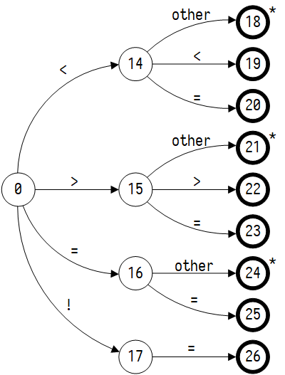
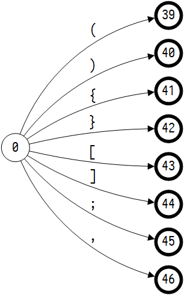

# 词法分析实验

本次实验选择 C 的子集 Mini-C 构造一个词法分析器

## C11 规范

C11 规范来自于 [cppreference.com](http://en.cppreference.com) 中所列举的 C 语言
结构描述。Mini-C 从中选取了常用的关键字来构成 C 语言的子集，包括数字、常用的数据
类型、条件控制语句、For 循环、和常见的运算操作符与函数调用。本次报告的示例程序如
下所示。

```c
// 本次实验的测试用例
int main()
{
    int a = 0;
    for (unsigned int i = 0; i < 10; i++)
    {
        if (i == 0)
            a = 1;
        else
            a++;
    }
    printf("hello, world!");
    return 0;
}
```

## Mini-C 正规式描述

参照 C11 规范，我们得到 Mini-C 的词法正规式。

```
delim       [ \t\n]
ws          {delim}+
digit       [0-9]
digits      {digit}+
number      {digits}(\.{digits})?([Ee][+-]?{digits})?
symbol      "("|")"|"{"|"}"|";"|"["|"]"|","
letter_     [A-Za-z\_]
id          {letter_}({letter_}|{digit})*
str         \"[^\"]*\"
comparison  "<"|">"|"<="|">="|"=="|"!="
operator    "+"|"-"|"*"|"/"|"="|"++"|"--"|"<<"|">>"|"||"|"&&"
```

有一些简单的正则表达式模式，比如 if。如果我们在输入中看到两个字母 if，并且 if 之
后没有跟随其他字母和数字，就会返回词法单元 IF。这样的保留字我们用一个保留字表来
维持，在获得词素之后参照保留字来判断词法单元是什么。其他关键字处理方式与之类似。

```
main if else for void char int signed unsigned return
```

## 正则表达式到自动机

我们用手工的方式将正则表达式转化为状态转化图，为了简化图，有些边上的标号表示了一
组字符，开始状态分离成子图的开始状态，实际上每一幅图的状态 0 都是同一个开始状态
。在构造 NFA 的时候我们使用的标号即是图上的标号。\
其次，接受状态的星号 \* 表示改状态需要回退一个字符。other 边的含义是排除其他出边以
外的其他可能。

空白符的状态转化图


无符号数字的状态转化图


id 和关键字的状态转化图


比较运算符和其他运算符的状态转化图



另一些运算符的状态转化图


符号的状态转化图



字符串的状态转化图


巧合的是我们的构造结果并没有包含 ε 边。实际上这是一个 DFA。考虑到 ASCII 码的有限
性，我们可以用一个表来转换表来表示该 DFA。由于状态转化表比较大，此处不列出。另外
，考虑到输入结束和非法字符的情况，我们新增一个接受状态，当时别到非法字符和结束标
记的时候转入该状态，结束整个程序。由于这个状态不是识别语言的必要状态，所以也不列
出。

## 词法分析程序

### 程序结构

本程序分四个类，其中 App 作为入口类，DFA 类从 resource 中读取一个状态转化表
，Lexer 类做词法分析，Token 是一个词素。资源文件包括一个由 Mini-C 编写的程序以及
识别语言的状态转化表。为了节约空间，代码经过了适当的压缩。

### 程序源码

作为词素单元的 Token 包含了一个词素的标签和值，标签是一个词素的分类。

```java
package shell7.lexer; // file: Token.java
public class Token {
    private final String tag, value;
    public Token(String tag, String value) { this.tag = tag; this.value = value; }
    public String getTag() { return tag; }
    public String getValue() { return value; }
    @Override
    public String toString() { return getTag() + ":\'" + getValue() + "\'"; }
}
```

DFA 储存了一个状态转化表，通过查表来确定下一个状态和所需要执行的操作。

```java
package shell7.lexer; // file: DFA.java
import java.io.BufferedReader;
import java.io.FileReader;
import java.io.IOException;
public class DFA {
    private int[][] table = new int[26][50];
    private boolean[] accept = new boolean[50];
    private boolean[] back = new boolean[50];
    public DFA() throws IOException {
        BufferedReader br = new BufferedReader(new FileReader("./resource/dfa.txt"));
        String line; int index = 0;
        while ((line = br.readLine()) != null) {
            String[] split = line.split("[ \t\n]+");
            for (int i = 0; i < split.length; i++) {
                if (split[i].equals("*")) // accept and go back
                    table[index][i] = -1;
                else if (split[i].equals("$")) // just accept
                    table[index][i] = -2;
                else if (split[i].equals("#")) // unreachable
                    table[index][i] = -3;
                else
                    table[index][i] = Integer.parseInt(split[i]);
            }
            index++;
        }
        for (int i = 0; i < accept.length; i++) {
            if (table[0][i] == -1) {
                accept[i] = back[i] = true;
            } else if (table[0][i] == -2) {
                accept[i] = true; back[i] = false;
            } else { accept[i] = false; back[i] = false; }
        }
    }
    public boolean isStop(int state) { return state == -3; }
    public boolean isAccept(int state) { return accept[state]; }
    public boolean isBack(int state) { return back[state]; }
    public int nextState(int state, char cond) throws Exception {
        int index;
        if (Character.isWhitespace(cond))
            index = 0;
        else if (Character.isDigit(cond))
            index = 1;
        else if (Character.isLetter(cond))
            index = 2;
        else {
            switch (cond) {
                case '.': index = 3  ;break; case '|': index = 14 ;break;
                case 'E': index = 4  ;break; case '&': index = 15 ;break;
                case 'e': index = 5  ;break; case '(': index = 16 ;break;
                case '<': index = 6  ;break; case ')': index = 17 ;break;
                case '>': index = 7  ;break; case '{': index = 18 ;break;
                case '=': index = 8  ;break; case '}': index = 19 ;break;
                case '!': index = 9  ;break; case '[': index = 20 ;break;
                case '+': index = 10 ;break; case ']': index = 21 ;break;
                case '-': index = 11 ;break; case ';': index = 22 ;break;
                case '*': index = 12 ;break; case ',': index = 23 ;break;
                case '/': index = 13 ;break; case '"': index = 24 ;break;
                                             default : index = 25 ;break;
            }
        }
        return table[index][state];
    }
    public String stateType(int state) throws Exception {
        switch (state) {
            case 2: return "WS";
            case 10: return "INTEGER";
            case 9: case 11: return "FLOAT";
            case 13: return "ID";
            case 18: case 20: case 21: case 23: case 25: case 26:
                return "COMPARISION";
            case 19: case 22: case 24: case 31: case 32: case 33:
            case 34: case 35: case 36: case 37: case 38:
                return "OPERATOR";
            case 39: case 40: case 41: case 42: case 43: case 44:
            case 45: case 46: return "SYMBOL";
            case 48: return "STRING";
            case 49: return "STOP";
            default: return "...";
        }
    }
}
```

词法分析在 Lexer 中完成，每次分析出一个词素。

```java
package shell7.lexer; // file: Lexer.java
import java.io.BufferedReader;
import java.io.IOException;
import java.util.Hashtable;
public class Lexer {
    private char peek; private DFA dfa;
    private Hashtable<String, Token> words;
    private BufferedReader bufferedReader;
    public Lexer(BufferedReader reader) throws Exception {
        init(); bufferedReader = reader;
    }
    private void init() throws Exception {
        peek = ' '; dfa = new DFA();
        words = new Hashtable<String, Token>();
        reserve(new Token("MAIN", "main"));
        reserve(new Token("IF", "if"));
        reserve(new Token("ELSE", "else"));
        reserve(new Token("FOR", "for"));
        reserve(new Token("TYPE", "void"));
        reserve(new Token("TYPE", "char"));
        reserve(new Token("TYPE", "int"));
        reserve(new Token("MODIFIER", "signed"));
        reserve(new Token("MODIFIER", "unsigned"));
        reserve(new Token("RETURN", "return"));
    }
    public void reserve(Token w) { words.put(w.getValue(), w); }
    public void readNextChar() throws IOException {
        peek = (char) bufferedReader.read();
    }
    public Token getNextToken() throws Exception {
        int state = 0; int next;
        StringBuffer buffer = new StringBuffer();
        while (true) {
            next = dfa.nextState(state, peek);
            String stateName = dfa.stateType(next);
            if (dfa.isStop(next)) { return null; }
            if (dfa.isAccept(next)) { // Accept state
                if (dfa.isBack(next)) { // State with *
                    if (words.containsKey(buffer.toString())) // Check keywords
                        return words.get(buffer.toString());
                    if (stateName.equals("WS")) { // Ignore whitespace
                        state = 0;  buffer = new StringBuffer(); continue;
                    }
                    return new Token(stateName, buffer.toString());
                } else {
                    buffer.append(peek); readNextChar();
                    return new Token(stateName, buffer.toString());
                }
            }
            state = next; buffer.append(peek); readNextChar();
        }
    }
}
```

### 分析结果

为了节省空间，结果输出连接下页，先左后右。

```
TYPE:'int'                SYMBOL:'{'
MAIN:'main'               IF:'if'
SYMBOL:'('                SYMBOL:'('
SYMBOL:')'                ID:'i'
SYMBOL:'{'                COMPARISION:'=='
TYPE:'int'                INTEGER:'0'
ID:'a'                    SYMBOL:')'
OPERATOR:'='              ID:'a'
INTEGER:'0'               OPERATOR:'='
SYMBOL:';'                INTEGER:'1'
FOR:'for'                 SYMBOL:';'
SYMBOL:'('                ELSE:'else'
MODIFIER:'unsigned'       ID:'a'
TYPE:'int'                OPERATOR:'++'
ID:'i'                    SYMBOL:';'
OPERATOR:'='              SYMBOL:'}'
INTEGER:'0'               ID:'printf'
SYMBOL:';'                SYMBOL:'('
ID:'i'                    STRING:'"hello, world!"'
COMPARISION:'<'           SYMBOL:')'
INTEGER:'10'              SYMBOL:';'
SYMBOL:';'                RETURN:'return'
ID:'i'                    INTEGER:'0'
OPERATOR:'++'             SYMBOL:';'
SYMBOL:')'                SYMBOL:'}'
```
