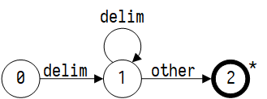
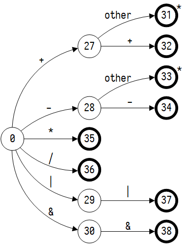
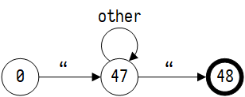

# 词法分析实验

本次实验选择 C 的子集 Mini-C 构造一个词法分析器

## C11 规范

C11 规范来自于 [cppreference.com](http://en.cppreference.com) 中所列举的 C 语言
结构描述。Mini-C 从中选取了常用的关键字来构成 C 语言的子集，包括数字、常用的数据
类型、条件控制语句、For 循环、和常见的运算操作符与函数调用。本次报告的示例程序如
下所示。

```c
// filename: test.mini
int main(int argc, char* args[])
{
    int count = 1;
    for (unsigned int i = 0; i < argc; i++)
    {
        if (i == 0)
            printf("%s\n", args[i]);
        else
            printf("%d:\t%s", count, args[i]);
        count++;
    }
    return 0;
}
```

## Mini-C 正规式描述

参照 C11 规范，我们得到 Mini-C 的词法正规式。

```
delim       [ \t\n]
ws          {delim}+
digit       [0-9]
digits      {digit}+
number      {digits}(\.{digits})?([Ee][+-]?{digits})?
symbol      "("|")"|"{"|"}"|";"|"["|"]"|","
letter_     [A-Za-z\_]
id          {letter_}({letter_}|{digit})*
str         \"[^\"]*\"
comparison  "<"|">"|"<="|">="|"=="|"!="
operator    "+"|"-"|"*"|"/"|"="|"++"|"--"|"<<"|">>"|"||"|"&&"
```

有一些简单的正则表达式模式，比如 if。如果我们在输入中看到两个字母 if，并且 if 之
后没有跟随其他字母和数字，就会返回词法单元 IF。这样的保留字我们用一个保留字表来
维持，在获得词素之后参照保留字来判断词法单元是什么。其他关键字处理方式与之类似。

```
main if else for void char int signed unsigned return
```

## 正则表达式到自动机

我们用手工的方式将正则表达式转化为状态转化图，为了简化图，有些边上的标号表示了一
组字符，开始状态分离成子图的开始状态，实际上每一幅图的状态 0 都是同一个开始状态
。在构造 NFA 的时候我们使用的标号即是图上的标号。\
其次，接受状态的星号 \* 表示改状态需要回退一个字符。other 边的含义是排除其他出边以
外的其他可能。

空白符的状态转化图



无符号数字的状态转化图


id 和关键字的状态转化图


比较运算符和其他运算符的状态转化图


另一些运算符的状态转化图



符号的状态转化图


字符串的状态转化图



巧合的是我们的构造结果并没有包含 ε 边。实际上这是一个 DFA。考虑到 ASCII 码的有限性，我们可以用一个表来转换表来表示该 DFA。